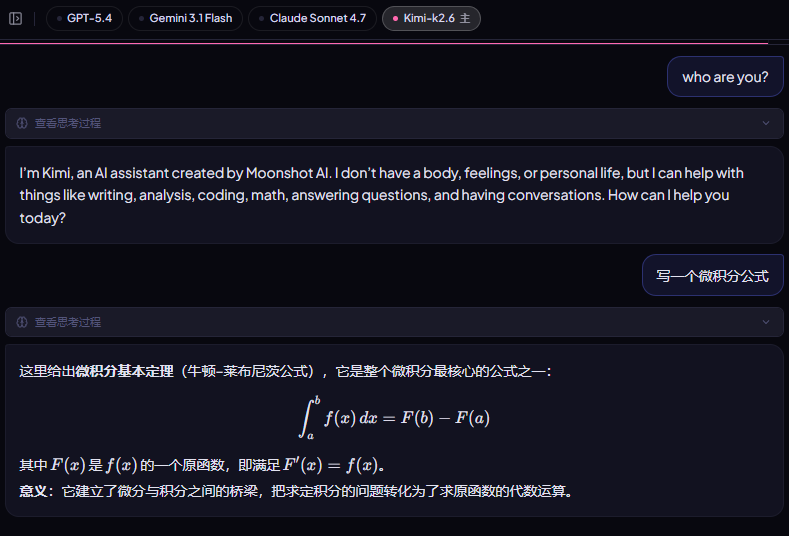
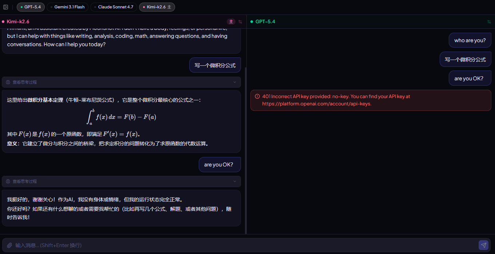
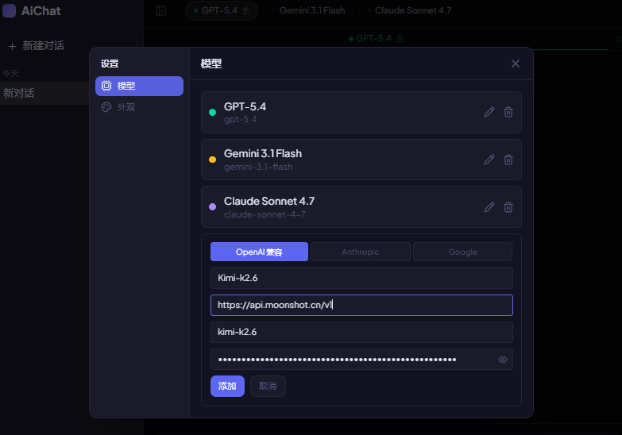

# AiChat

多模型并发 AI 聊天应用。同时向多个模型发送相同问题，横向对比回答。支持浏览器运行，也可打包为桌面应用（Tauri）。

---

## 功能

- **多模型并发**：同时对话 OpenAI、Google、Anthropic 等不同模型，回答实时并排展示
- **自适应布局**：宽屏横向多列，窄屏选项卡切换
- **流式输出**：所有模型同步流式渲染，含思考块（Claude Extended Thinking / o1 reasoning）
- **Markdown 渲染**：GFM 表格、代码高亮、KaTeX 数学公式
- **图片输入**：上传图片附带消息发送给支持视觉的模型
- **模型参数**：每个模型独立配置 System Prompt 和 Temperature
- **会话管理**：多会话，每个会话独立的模型选择和参数
- **自定义模型**：支持添加任意 OpenAI 兼容端点（Ollama、LM Studio 等）
- **主题**：深色 / 浅色 / 跟随系统
- **桌面端**：Tauri 打包，Rust 后端绕过 WebView CORS 限制





---

## 快速开始

### 前置要求

- Node.js 18+
- 至少一个 AI 服务的 API Key

### 安装

```bash
git clone <repo>
cd AiChat
npm install
```

### 开发

```bash
# 浏览器模式
npm run dev

# 桌面应用（需要安装 Rust）
npm run tauri:dev
```

### 生产构建

```bash
# Web
npm run build

# 桌面安装包
npm run tauri:build
```

---

## 技术栈

| 层级 | 技术 |
|---|---|
| 框架 | React 19 + TypeScript + Vite |
| 状态 | Zustand（持久化到 localStorage） |
| 样式 | Tailwind CSS 4 + CSS 变量主题 |
| UI 组件 | Radix UI（Dialog、Slider、ScrollArea） |
| 内容渲染 | react-markdown + remark-gfm + remark-math + rehype-katex + rehype-highlight |
| AI SDK | @anthropic-ai/sdk · openai · @google/generative-ai |
| 桌面端 | Tauri 2 + Rust（reqwest 流式代理） |
| 测试 | Vitest + Testing Library |

---

## 项目结构

```
src/
├── types/index.ts              # 全部类型定义
├── store/
│   ├── conversationStore.ts    # 会话、消息、线程管理
│   ├── settingsStore.ts        # 设置、模型配置
│   └── streamStore.ts          # 流式请求状态
├── hooks/
│   ├── useStream.ts            # 多模型并发流式请求
│   ├── useAdaptiveLayout.ts    # 宽/窄布局检测
│   └── useTheme.ts             # 主题同步
├── lib/
│   ├── buildMessages.ts        # 历史消息转 API 格式
│   ├── presetModels.ts         # 预设模型与颜色
│   └── streaming/              # 各提供商流式适配器
│       ├── index.ts
│       ├── anthropic.ts
│       ├── openai.ts
│       ├── google.ts
│       └── proxy.ts            # Tauri CORS 代理客户端
└── components/
    ├── layout/                 # AppShell、Sidebar
    ├── chat/                   # ModelBar、ModelColumn、NarrowLayout、WideLayout、InputZone 等
    ├── content/                # MarkdownRenderer、CodeBlock、ImageViewer、VideoPlayer
    ├── settings/               # SettingsModal、ModelList
    └── ui/                     # Radix 组件封装
```

---

## 预设模型

| 模型 | 提供商 | 颜色 |
|---|---|---|
| GPT-5.4 | OpenAI | 绿 `#34d399` |
| Gemini 3.1 Flash | Google | 黄 `#fbbf24` |
| Claude Sonnet 4.7 | Anthropic | 紫 `#a78bfa` |

在设置中可添加自定义模型（任意 OpenAI 兼容端点）。自定义模型自动从 6 种颜色中轮转分配。



---

## 核心数据流

```
用户输入
  → addUserTurn（快照当前参数）
  → 并发 callStream × N 模型
      ├─ buildMessages（组装多轮历史，各模型独立视角）
      ├─ 适配器转换（NormalizedContent → 各提供商格式）
      └─ AsyncGenerator<StreamChunk>
           ├─ text            → appendChunk（末尾追加）
           ├─ thinking        → appendThinking（插入开头）
           ├─ image_generated → appendGeneratedImage
           └─ done            → 结束流
```

---

## 多模型并发机制

每次发送消息时，`useStream` 用 `Promise.allSettled` 向所有选中模型并发发请求。各模型的响应存储在 `Conversation.threads[modelId].responses[]` 中，索引与 `userTurns[]` 对齐。某个模型失败不影响其他模型。

---

## Tauri 桌面端

浏览器直接调用 AI API 会遇到 CORS 限制。桌面模式下，AI SDK 的 `fetch` 被替换为 `tauriProxyFetch`，请求通过 Rust 后端的 `stream_post` 命令发出，以 4 个 Tauri 事件（`sp_start` / `sp_chunk` / `sp_err` / `sp_done`）将响应流回前端。SDK 对此完全透明。

---

## 开发说明

### 添加新提供商

1. 在 `src/types/index.ts` 的 `Provider` 类型中添加新值
2. 在 `src/lib/streaming/` 下新建适配器，实现 `AsyncGenerator<StreamChunk>`
3. 在 `src/lib/streaming/index.ts` 的 `callStream` 中添加分支

### 运行测试

```bash
npx vitest
```

### 代码检查

```bash
npm run lint
```
